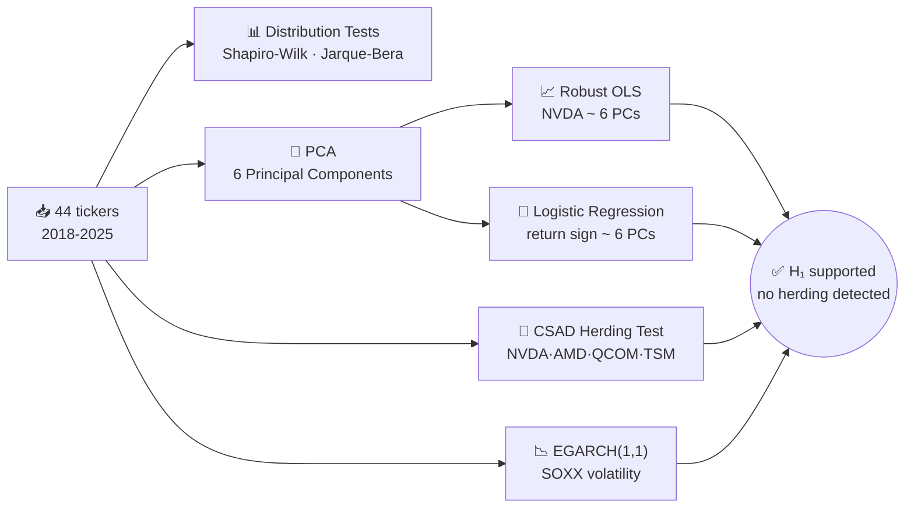
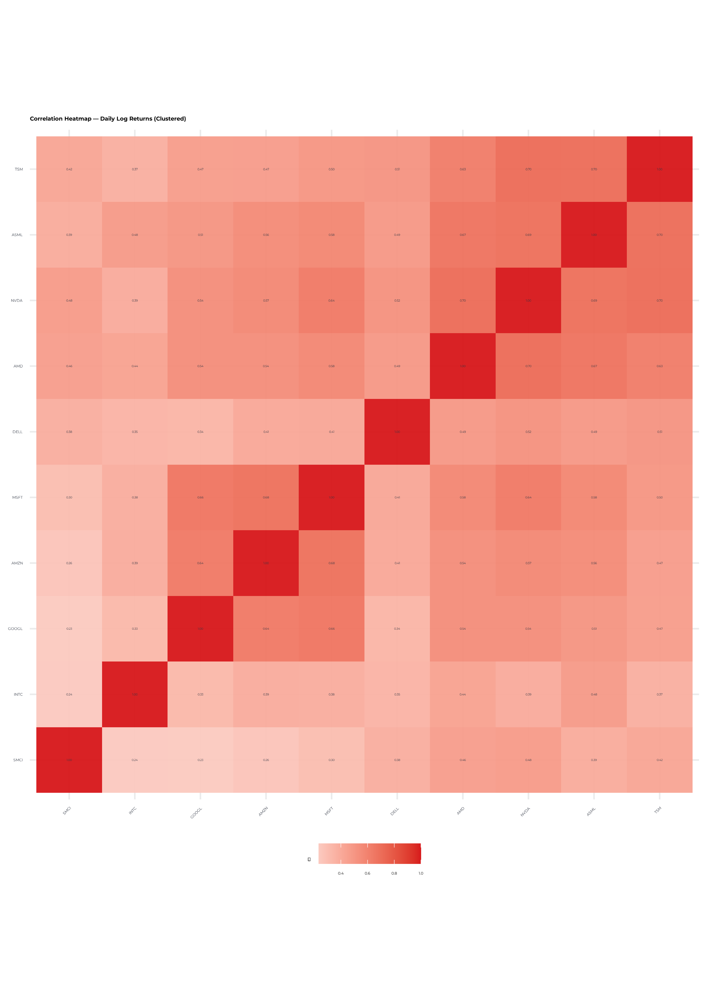
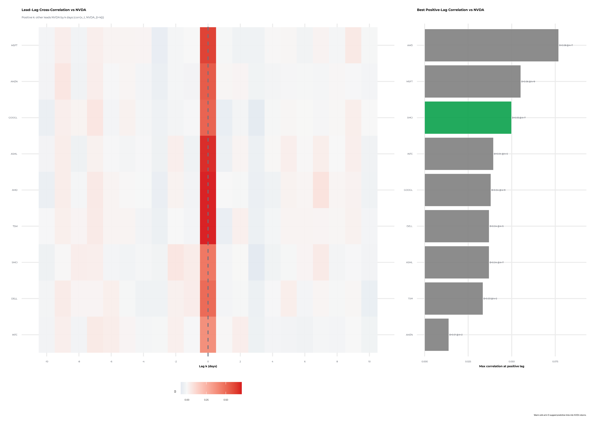
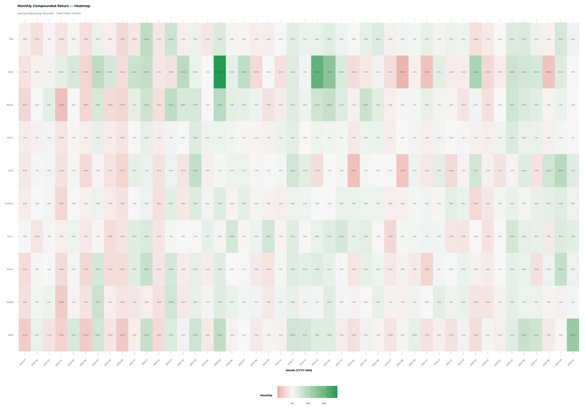
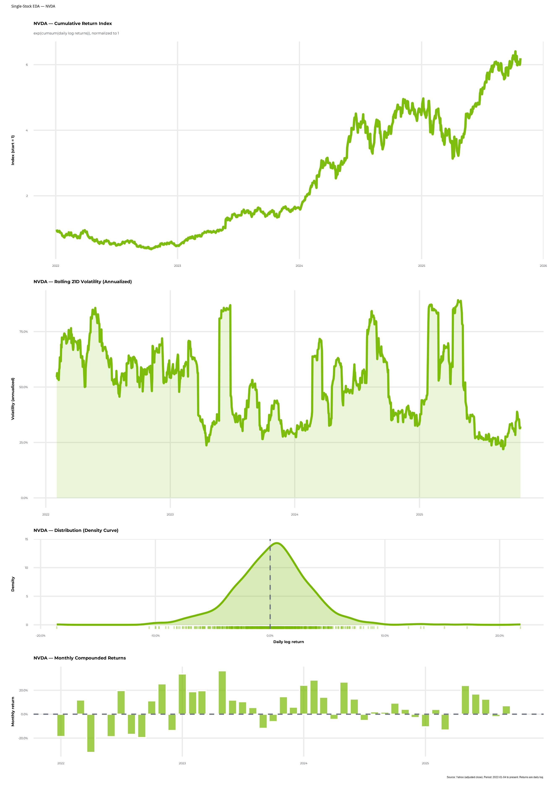

# Return Transmission & Herding Behavior in the Semiconductor Sector

**Financial Econometrics · Final Assessment**

**MSc International Business Management & Finance**

  
  
  
  
  
  

<h3>💭 Is NVIDIA's success just its own, or is the whole semiconductor chain moving together?</h3>

PCA · Robust OLS · Logistic Regression · CSAD Herding Test · EGARCH Volatility Modeling

  

---

## 📌 TL;DR

| Do chain returns move together? | Do investors herd? | Is volatility "normal"? | Can direction be predicted? |
|:---:|:---:|:---:|:---:|
| ✅ **82.2%** of NVDA's moves explained by 6 market factors (PCA) | ❌ **No** — stocks *diverge* more when the market swings | ❌ No — fat tails (kurtosis 7.72), asymmetric shocks | 🎯 **80% accuracy** with a simple logit on 6 PCs |

---

## 📂 Contents

- [❓ Research Question](#-research-question)
- [📊 Data](#-data)
- [🔄 Analysis Pipeline](#-analysis-pipeline)
- [🧮 Methods & Key Findings](#-methods--key-findings)
- [🖼️ Visuals](#️-visuals)
- [✅ Conclusion](#-conclusion)
- [📁 Repo Contents](#-repo-contents)
- [🛠️ Stack](#️-stack)

---

## ❓ Research Question

> Is there a significant relationship between the stock returns of companies operating at different stages of the global semiconductor supply chain — **design** (NVIDIA, AMD), **manufacturing** (TSMC, Intel), and **equipment** (ASML)?

| Hypothesis | Statement |
|---|---|
| **H₀** | No significant relationship between chain-segment returns |
| **H₁** | There is a significant relationship between chain-segment returns |

💬 Why this topic (personal motivation)

 

> "At this moment NVIDIA is the most valuable company in the world, driven by the boom in AI and data, and I personally hold NVIDIA in my investment portfolio... I currently work at LVMH, and even in the luxury sector I see increasing investment in AI, data systems, and digital infrastructure."
> — from the original research question

## 📊 Data

| | |
|---|---|
| 📅 **Period** | 2018-01-01 → 2025-10-24 (daily, Yahoo Finance) |
| 🏭 **Universe** | 44 tickers across the full value chain |
| 🔗 **Segments** | *Design* (NVDA, AMD, AVGO, QCOM…) · *Manufacturing* (TSM, INTC, MU…) · *Equipment* (ASML, AMAT, LRCX…) · *Materials* · *OSAT* · *Distributors* · sector ETFs (SOXX, SMH, XSD) |
| 🌐 **Macro controls** | S&P 500, NASDAQ, VIX, 10Y yield, T-Bill, US Dollar Index, WTI, Copper, AAPL, TSLA |
| 🧱 **Structure** | Panel data — time series × cross-section |

## 🔄 Analysis Pipeline

## 🧮 Methods & Key Findings

<table>
<tr><th>Section</th><th>Method</th><th>Result</th></tr>
<tr>
<td><b>📊 Distribution</b></td>
<td>Shapiro-Wilk, Jarque-Bera, skew/kurtosis</td>
<td>NVDA log-returns <b>not normal</b> (p≈0) · skew -0.194 · kurtosis 7.72 → 🐘 fat tails</td>
</tr>
<tr>
<td><b>📈 Regression</b></td>
<td>PCA (44 tickers → 6 PCs) + OLS, HC3 robust SE</td>
<td>6 PCs explain <b>82.19%</b> of variance · Adj. R² = <b>0.5062</b> · only PC1 significant (p=0.0007)</td>
</tr>
<tr>
<td><b>🎯 Classification</b></td>
<td>Logistic regression (return sign ~ 6 PCs)</td>
<td>Accuracy <b>0.80</b> · AIC = 32.21</td>
</tr>
<tr>
<td><b>🐑 Herding</b></td>
<td>CSAD (Chang–Cheng–Khorana) vs. Rm, Rm² — NVDA/QCOM/TSM/AMD, 2020–2025</td>
<td>β₂ = <b>+2.126</b> (significant, positive) → <b>no herding</b>: stocks diverge, not converge</td>
</tr>
<tr>
<td><b>📉 Volatility</b></td>
<td>Ljung-Box + ARCH-LM (p&lt;0.001) → EGARCH(1,1) + ARMA(1,1), Student-t, on SOXX</td>
<td>Leverage effect γ₁=0.167 · persistence β₁=<b>0.96</b> · spikes around COVID-19, 2022 inflation, 2024-25 AI correction</td>
</tr>
<tr>
<td><b>🧮 Factor Analysis</b></td>
<td>PCA on all 44 tickers</td>
<td>6 PCs explain 74.5%. PC1 = broad semi-market factor · PC2 = macro/rates · PC5 = tech momentum</td>
</tr>
</table>

## 🖼️ Visuals

<table>
<tr>
<td width="50%">
Correlation clusters across the semiconductor value chain
</td>
<td width="50%">
Lead-lag impact map between segments
</td>
</tr>
<tr>
<td width="50%">
Monthly return seasonality
</td>
<td width="50%">
NVIDIA exploratory data analysis
</td>
</tr>
</table>

## ✅ Conclusion

The results **support H₁**: semiconductor-chain returns are significantly linked through common market factors (PCA). But there is **no evidence of herding** among the sector's biggest names — investors react differently to information rather than following the crowd.

> 💡 **For portfolio management**: intra-sector diversification still has value, but risk models need to account for fat tails and asymmetric volatility (EGARCH) — not just normal-distribution assumptions.

⚠️ <b>Limitations</b> (self-critique from the original report)

 

- Potential omitted-variable bias — only a subset of the value chain was included.
- PCA reduces but doesn't eliminate the risk of hidden factors.
- Daily-return focus may miss longer-term structural trends.
- Normality doesn't hold for raw returns (expected in finance), though final OLS residuals happened to look normal in this small sample.

## 📁 Repo Contents

| File | Description |
|---|---|
| 📜 [`analysis.qmd`](analysis.qmd) | Full R/Quarto source — data pull, EDA, PCA, OLS/Logit, CSAD herding test, EGARCH |
| 📓 [`docs/index.html`](docs/index.html) | Rendered notebook — served live via [GitHub Pages](https://ludodelot.github.io/rsb-financial-econometrics-semiconductors/) (GitHub doesn't render raw `.html` files in-browser, so this is the way to actually read it without downloading) |
| 📄 [`Report.pdf`](Report.pdf) | Full written report with interpretation of every result |
| ✅ [`LLM_Usage_Disclosure.pdf`](LLM_Usage_Disclosure.pdf) | Official AI-usage disclosure (required by the course) |
| 🖼️ `figures/` | Key charts (correlation heatmap, lead-lag map, monthly heatmap, NVDA EDA) |

## 🛠️ Stack

---

Author **[Ludovic Delot](https://www.linkedin.com/in/delot/)** 
MSc International Business Management & Finance · [Rennes School of Business](https://www.rennes-sb.com/)

